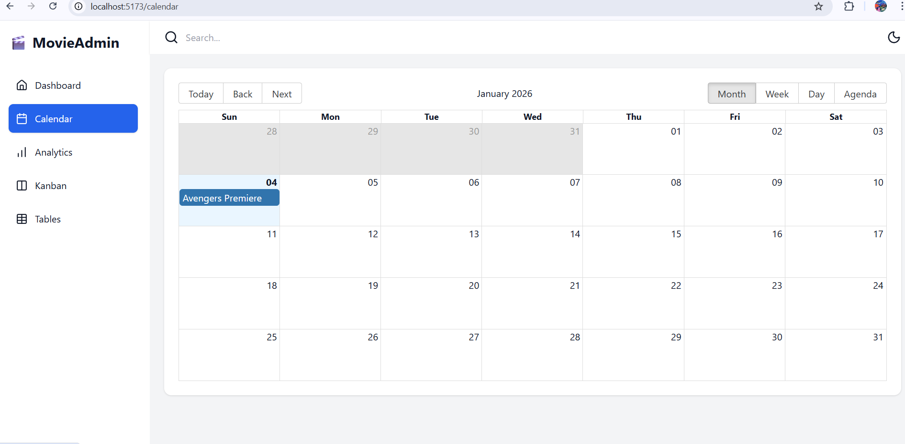
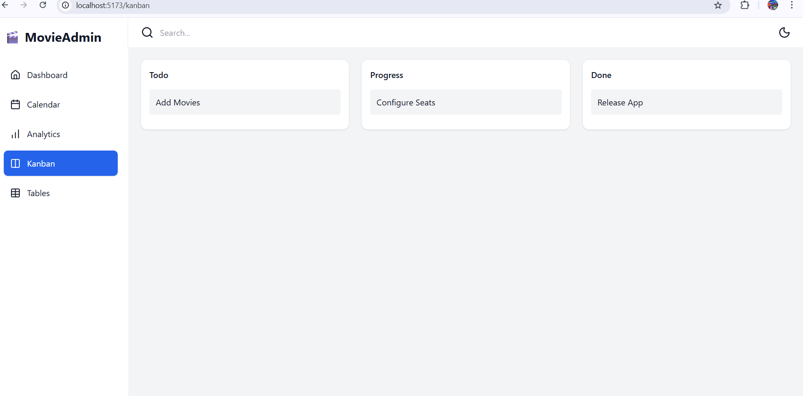
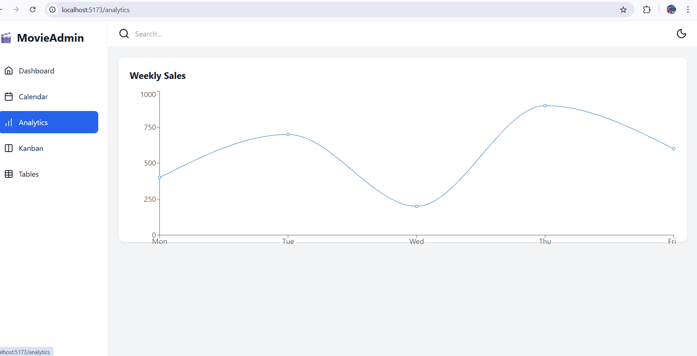
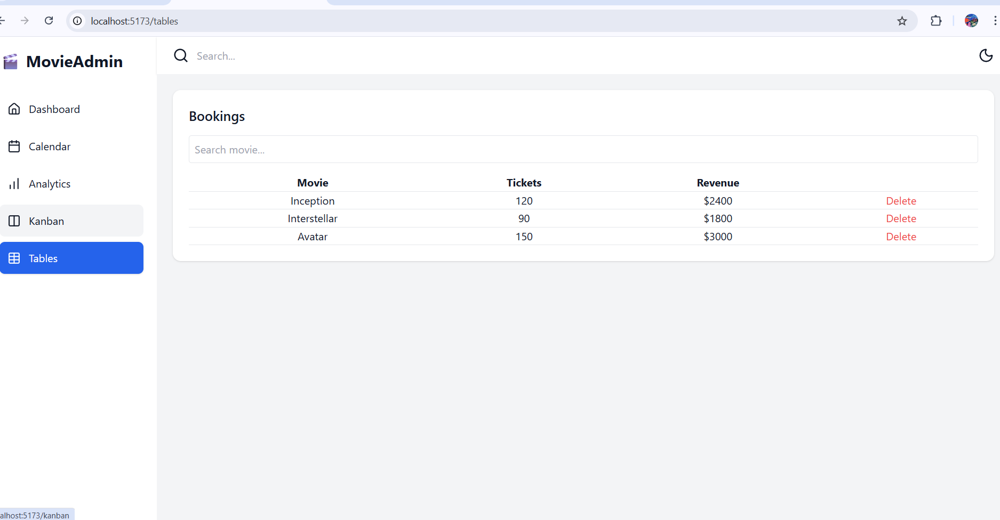

# 🎬 Movie Admin Dashboard

A modern, fully responsive Admin Dashboard built with **React** and **Tailwind CSS** for managing a movie booking platform.  
It includes real-world admin features like analytics, scheduling, task management, and dynamic data handling, with a clean UI and dark mode support.

---

## ✨ Features

### 📊 Dashboard Overview
- Total Users, Tickets Sold, Revenue Summary
- Real-time stat cards

### 📅 Calendar
- Manage movie schedules
- Interactive calendar using `react-big-calendar`

### 🧩 Kanban Board
- Task management workflow
- Drag & drop support using `@hello-pangea/dnd`
- Create, move, and organize tasks visually

### 📈 Analytics
- Revenue & booking insights
- Beautiful charts for data visualization

### 🧾 Dynamic Tables
- Full CRUD operations
- Search & filter functionality
- Pagination for large datasets

### 🌙 Theme System
- Smooth Dark / Light mode
- Global theme management with React Context

### 🧭 Layout & Navigation
- Sidebar navigation with icons
- Topbar with theme toggle
- Fully responsive design

---

## 🛠️ Tech Stack

| Technology       | Usage                       |
|-----------------|-----------------------------|
| React            | Frontend framework          |
| Tailwind CSS     | UI Styling                  |
| React Router     | Routing                     |
| Lucide Icons     | Icon system                 |
| Moment.js        | Date handling               |
| react-big-calendar | Calendar                  |
| @hello-pangea/dnd | Kanban Drag & Drop         |
| Context API      | Theme Management            |

---
---

## 🖼️ Screenshots

### Dashboard

### Calendar

### Kanban Board

### Analytics

### Bookings Table

